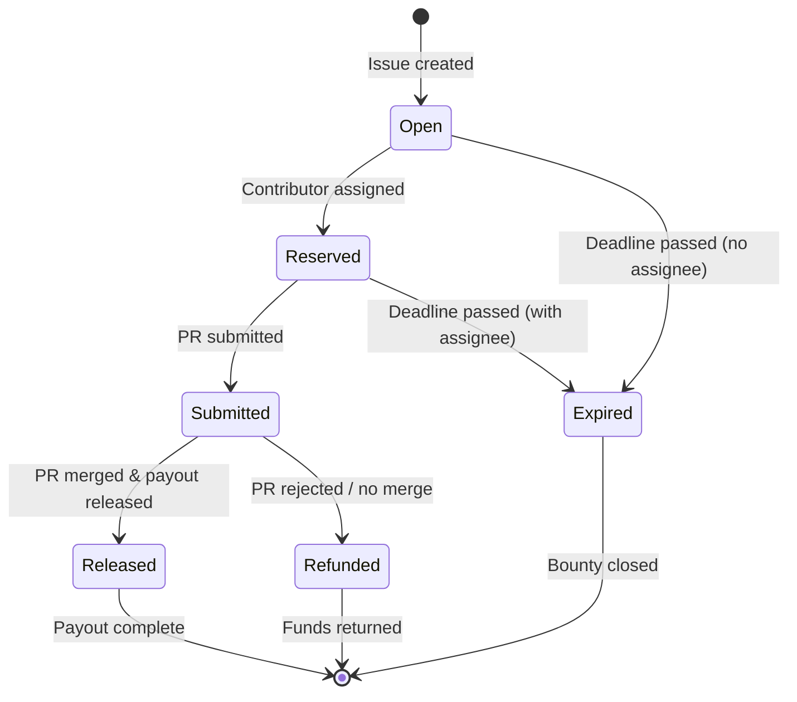

# Bounty Status State Machine

## Transitions

| From | To | Trigger |
|------|-----|---------|
| `Open` | `Reserved` | Contributor signs reservation transaction |
| `Open` | `Expired` | Deadline passes without reservation |
| `Reserved` | `Submitted` | Contributor submits pull request |
| `Reserved` | `Expired` | Deadline passes with reservation but no submission |
| `Submitted` | `Released` | Maintainer merges PR and releases payment |
| `Submitted` | `Refunded` | Maintainer rejects PR or closes without merge |
